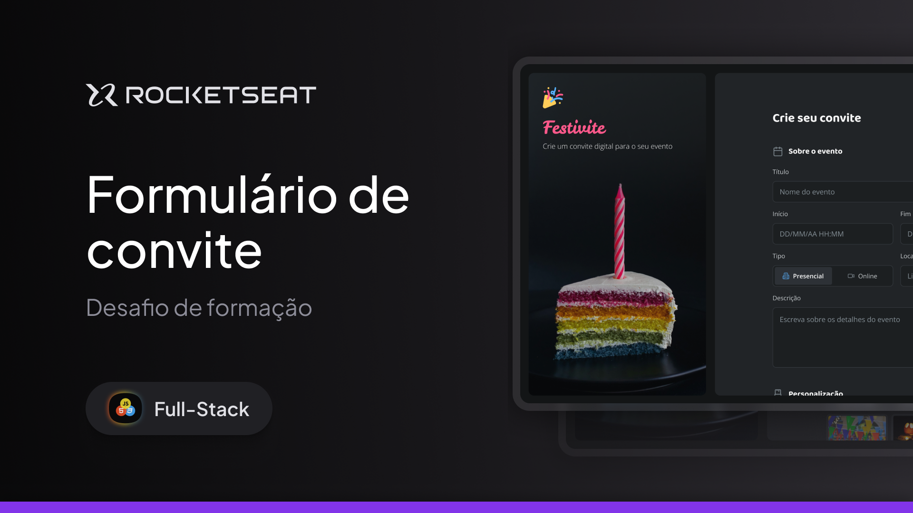

# 🌎 Desafio 03 Rocketseat — Formulário de convite

Projeto desenvolvido como parte do **Desafio 03** do curso **Full Stack**, com o objetivo de construir uma página estática apresentando um **Formulário de convite**.

## 🖥️ Tecnologias utilizadas

- **HTML**
- **CSS**

## 🎯 Objetivo do projeto

O desafio consistia em criar uma página de apresentação de um formulário para a criação de um convite personalizado, aplicando boas práticas de estruturação semântica no HTML e estilização no CSS, incluindo:

- Uma imagem lateral estática;
- Uma página ao lado com rolagem;
- Inputs com regras de erros caso não preenchido corretamente;
- Input de data e hora no mesmo campo apresentando erro caso um dos dois tenha sido preenchido e outro não;
- Seções com escolha para tema e cor principal do convite;
- Botão para escolha de estilo;
- Scrollbar personalizado para manter a identidade do estilo da página;

## 🧠 Aprendizados

Durante o desenvolvimento, foram aplicados conceitos de:

- Hierarquia de tags HTML;
- Organização de layout com margens, paddings e espaçamentos;
- Estilização de elementos webkit;
- Tipografia e cores consistentes com a proposta visual.

## 📸 Prévia do projeto

> **

## 🚀 Como visualizar

1. Faça o clone do repositório:
   ```bash
   git clone https://github.com/WillFriedl/desafio-03-fullstack-formulario-de-convite
